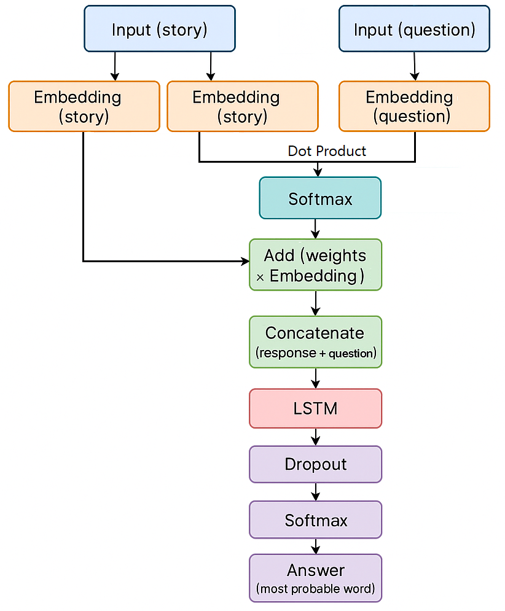

# Story Bot

## 🌍 Versiones Multilingües del README

- 🇫🇷 [Francés](./README.fr.md)
- 🇬🇧 [Inglés](./README.md)
- 🇪🇸 [Español (estás aquí)](#)

---

### 📘 Resumen del Proyecto
Este proyecto, desarrollado por un equipo de tres como parte de nuestra Maestría, tiene como objetivo crear un **chatbot capaz de responder preguntas en inglés sobre una historia**. Para ello, utilizamos el **conjunto de datos bAbI** de Facebook AI Research, diseñado para evaluar las capacidades de razonamiento de los modelos de aprendizaje automático.

El bot lee una historia, luego espera preguntas relacionadas e intenta responderlas de manera coherente. Se basa en un modelo de embedding entrenado directamente con el conjunto de datos.

---

## 📁 Estructura del Proyecto

El proyecto está estructurado en varios directorios, cada uno con un rol específico:

- **Code**: Contiene todos los scripts de Python, incluyendo la creación del modelo, su entrenamiento, la interfaz gráfica, así como las funciones utilitarias necesarias para el funcionamiento del chatbot.

- **Data**: Agrupa los archivos del conjunto de datos utilizados para el entrenamiento y las pruebas, particularmente las historias, preguntas y respuestas del conjunto de datos bAbI.

- **Network**: Almacena el modelo entrenado, incluyendo tanto la arquitectura de la red como los pesos asociados.

---

## 📊 Conjuntos de Datos

El conjunto de datos **bAbI**, desarrollado por Facebook AI Research (FAIR), es una colección sintética diseñada para probar las capacidades de razonamiento de los modelos de procesamiento del lenguaje natural.

Consiste en historias cortas seguidas de preguntas en inglés, cada una con una única respuesta correcta. Cada ejemplo está estructurado en tres partes: un contexto (en forma de oraciones numeradas), una pregunta y la respuesta esperada.

El objetivo es permitir que un modelo aprenda a leer una historia, a razonar a través de múltiples oraciones y a responder correctamente una pregunta basándose únicamente en la información relevante. Este conjunto de datos permite evaluar diversas habilidades como la comprensión espacial o temporal, el razonamiento lógico y la gestión de la memoria a corto plazo.

---

## ⚙️ Funcionamiento de una "Red de Memoria"

Una Red de Memoria es un modelo diseñado para resolver tareas de preguntas y respuestas sobre texto, simulando un proceso de razonamiento con memoria.

Aquí tienes una explicación sencilla y progresiva de su funcionamiento:

### 🧾 Paso 1 - Codificación de la historia
La historia se convierte en vectores mediante una codificación de tipo **embedding**. Cada palabra (o frase) se convierte en un vector numérico. El modelo crea dos representaciones paralelas de esta memoria:
- una para comparar la memoria con la pregunta
- la otra para extraer una respuesta contextual

### ❓ Paso 2 - Codificación de la pregunta
La pregunta se codifica por separado para que sea compatible con las representaciones de la historia.

### 🎯 Paso 3 - Cálculo de la atención
El modelo compara la pregunta con cada elemento de la historia codificada para determinar las partes más relevantes. Esto se realiza mediante un **mecanismo de atención**, que asigna pesos a cada frase de la historia.

### 📚 Paso 4 - Recuperación de la información relevante
Los pesos de atención se utilizan para combinar las partes importantes de la memoria y formar una respuesta contextual. Esta respuesta se fusiona luego con la codificación de la pregunta.

### 🔁 Paso 5 - Procesamiento secuencial con LSTM
La combinación de respuesta contextual + pregunta se pasa a una **LSTM**. Esta red secuencial permite razonar sobre la cronología y las dependencias entre los elementos de la memoria.

### 🗣️ Paso 6 - Predicción de la respuesta
La salida de la LSTM se proyecta en el espacio de las palabras conocidas (vocabulario), y luego se utiliza una función **softmax** para elegir la respuesta más probable.

### 📌 Resultado
El modelo aprende a leer, comprender y razonar sobre textos cortos para responder de manera pertinente a preguntas formuladas en inglés.

---

## 🧱 Arquitectura del modelo

Aquí tienes el esquema de la arquitectura de nuestro modelo, ilustrando el flujo de datos a través de las diferentes capas:



---

## 💻 Tecnologías Utilizadas

* **Lenguaje:** Python 3.10+
* **Librerías:** Keras
* **GUI:** Tkinter

---

## 🚀 Ejecutar el Proyecto

Para iniciar este proyecto y utilizar los modelos de clasificación de imágenes, sigue estos pasos:

1.  Clona el repositorio:
    ```bash
    git clone [https://github.com/Fab16BSB/story_bot.git](https://github.com/Fab16BSB/story_bot.git)
    ```

2.  Instala las dependencias:
    ```bash
    cd story_bot
    pip install -r requirements.txt
    ```

3.  Ejecuta el código:
    ```bash
    cd Code
    python Main.py
    ```

---

## 🖥️ Interfaz Gráfica con Tkinter

La interfaz de usuario está construida con **Tkinter**, un módulo estándar de Python para el desarrollo de interfaces gráficas. Incluye:

* Un área para mostrar la historia.
* Un área para mostrar la pregunta actual.
* Un campo para introducir una respuesta manual o consultar la generada.
* Botones para interactuar con el bot o cambiar de escenario.


---

## 🧪 Resultados

Estos ejemplos ilustran la capacidad del modelo para comprender un relato corto, razonar sobre su contenido y proporcionar respuestas coherentes dentro de las tareas propuestas por el conjunto de datos bAbI.


---

## ⚠️ Limitaciones

* El modelo está restringido al vocabulario presente en el conjunto de datos; no reconoce palabras que no figuren en él.
* El chatbot solo funciona en inglés; no se admite ningún otro idioma.
* El sistema no maneja ambigüedades ni interpretaciones complejas fuera de los escenarios previstos en el conjunto de datos.
* Las respuestas generadas se limitan a una sola palabra, lo que restringe la riqueza de las interacciones posibles.

---

## 🧑‍💻 Autores

* Zeineb Ghrib
* Nadia Essfini

---

## 📚 Fuentes

Nuestro proyecto se basa principalmente en los siguientes recursos:

📄 Artículo de referencia: *End-To-End Memory Networks* — [Consultar en arXiv](https://arxiv.org/pdf/1503.08895.pdf)

📦 Conjunto de datos utilizado: *bAbI dataset* — [Disponible en Kaggle](https://www.kaggle.com/datasets/roblexnana/the-babi-tasks-for-nlp-qa-system)
