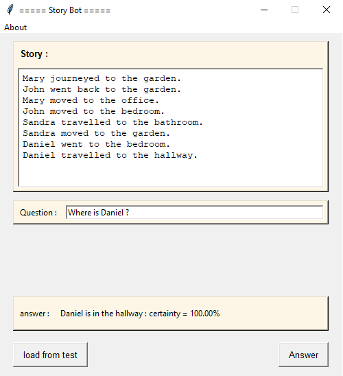

# Story Bot

## 🌍 Versions multilingues du README

- 🇫🇷 [Français (vous êtes ici)](#)
- 🇬🇧 [English](./README.md)
- 🇪🇸 [Español](./README.es.md)

---

## 📘 Aperçu du Projet

Ce projet, réalisé en trinôme dans le cadre de notre Master, vise à développer un **chatbot capable de répondre à des 
questions en anglais sur une histoire**. Nous utilisons pour cela le **[jeu de données bAbI](https://www.kaggle.com/datasets/roblexnana/the-babi-tasks-for-nlp-qa-system)** 
de Facebook AI Research, conçu pour évaluer les capacités de raisonnement des modèles d'apprentissage automatique.

Le bot lit une histoire, puis attend des questions en lien avec celle-ci, et tente d'y répondre avec cohérence. Il s’appuie sur un modèle d’embedding entraîné directement sur le dataset.

---

## 📁 Structure du Projet

Le projet est structuré en plusieurs répertoires, chacun ayant un rôle spécifique :


- **Code** : Contient l’ensemble des scripts Python, incluant la création du modèle, son entraînement, l’interface graphique, ainsi que les fonctions utilitaires nécessaires au fonctionnement du chatbot.


- **Data** : Regroupe les fichiers du jeu de données utilisé pour l’entraînement et les tests, notamment les histoires, questions et réponses issues du dataset bAbI.


- **Network** : Stocke le modèle entraîné, incluant à la fois l’architecture du réseau et les poids associés.

---

## 📊 Datasets
Le jeu de données **bAbI**, développé par Facebook AI Research (FAIR), est un ensemble synthétique conçu pour tester les capacités de raisonnement des modèles de traitement du langage naturel. 

Il se compose d’histoires courtes suivies de questions en anglais, avec une réponse unique à chaque fois. Chaque exemple est structuré en trois parties : un contexte (sous forme de phrases numérotées), une question, et la réponse attendue. 

L’objectif est de permettre à un modèle d’apprendre à lire une histoire, à raisonner sur plusieurs phrases et à répondre correctement à une question en s’appuyant uniquement sur les informations pertinentes. Ce dataset permet d’évaluer différentes compétences telles que la compréhension spatiale ou temporelle, le raisonnement logique et la gestion de la mémoire à court terme. 

---

## ⚙️ Fonctionnement d'un "Memory Network"

Un Memory Network est un modèle conçu pour résoudre des tâches de question-réponse sur du texte en simulant un processus de raisonnement avec mémoire.

Voici une explication simple et progressive de son fonctionnement :

### 🧾 Étape 1 - Encodage de l’histoire  
L’histoire est convertie en vecteurs via un encodage de type *embedding*. Chaque mot (ou phrase) devient un vecteur numérique. Le modèle crée deux représentations parallèles de cette mémoire :  
- l'une pour comparer la mémoire avec la question  
- l'autre pour extraire une réponse contextuelle  

### ❓ Étape 2 - Encodage de la question  
La question est encodée séparément pour être compatible avec les représentations de l’histoire.

### 🎯 Étape 3 - Calcul de l’attention  
Le modèle compare la question à chaque élément de l’histoire encodée pour déterminer les parties les plus pertinentes. Cela se fait via un mécanisme d’attention, qui attribue des poids à chaque phrase de l’histoire.

### 📚 Étape 4 - Récupération des informations pertinentes  
Les poids d’attention sont utilisés pour combiner les parties importantes de la mémoire afin de former une réponse contextuelle. Cette réponse est ensuite fusionnée avec l’encodage de la question.

### 🔁 Étape 5 - Traitement séquentiel avec LSTM  
La combinaison réponse contextuelle + question est passée dans une LSTM. Ce réseau séquentiel permet de raisonner sur la chronologie et les dépendances entre les éléments de la mémoire.

### 🗣️ Étape 6 - Prédiction de la réponse  
La sortie de la LSTM est projetée dans l’espace des mots connus (vocabulaire), puis une softmax est utilisée pour choisir la réponse la plus probable.

### 📌 Résultat 
Le modèle apprend à lire, comprendre et raisonner sur des textes courts pour répondre de façon pertinente à des questions posées en anglais.

---

## 🧱 Architecture du modèle 

Voici le schéma de l'architecture de notre modèle, illustrant le flux des données à travers les différentes couches :


---

## 💻 Technologies Utilisées

* **Langage:** Python 3.10+
* **Librairies:** Keras
* **GUI** Tkinter
---

## 🚀 Exécuter le Projet
Pour lancer ce projet et utiliser les modèles de classification d'images, suivez ces étapes :

1. Cloner le dépôt :
```
git clone https://github.com/Fab16BSB/story_bot.git
```

2. Installer les dépendances :
```
cd story_bot
pip install -r requirements.txt
```

3. Exécuter le code :
```
cd Code
python Main.py
```
---

## 🖥️ Interface Graphique avec Tkinter

L’interface utilisateur est construite avec **Tkinter**, un module standard de Python pour le développement d’interfaces graphiques. Elle comprend :

- Une zone pour afficher l’histoire.
- Une zone pour afficher la question actuelle.
- Un champ pour saisir une réponse manuelle ou consulter celle générée.
- Des boutons pour interagir avec le bot ou changer de scénario.


---

## 🧪 Résultats
Ces exemples illustrent la capacité du modèle à comprendre un court récit, raisonner sur son contenu et fournir des réponses cohérentes dans le cadre des tâches proposées par le dataset bAbI.





---

## ⚠️ Limitations

- Le modèle est restreint au vocabulaire présent dans le jeu de données : il ne reconnaît pas les mots qui n'y figurent pas.


- Le chatbot fonctionne uniquement en anglais ; aucune autre langue n’est prise en charge.


- Le système ne traite pas les ambiguïtés ni les interprétations complexes en dehors des scénarios prévus dans le dataset.


- Les réponses générées se limitent à un seul mot, ce qui restreint la richesse des interactions possibles.

---

## 🧑‍💻 Authors

- Zeineb Ghrib
- Nadia Essfini

---


## 📚 Sources

Notre projet s’appuie principalement sur les ressources suivantes :

📄 Article de référence : *End-To-End Memory Networks* — [Consulter sur arXiv](https://arxiv.org/pdf/1503.08895.pdf)

📦 Jeu de données utilisé : *bAbI dataset* — [Disponible sur Kaggle](https://www.kaggle.com/datasets/roblexnana/the-babi-tasks-for-nlp-qa-system)
