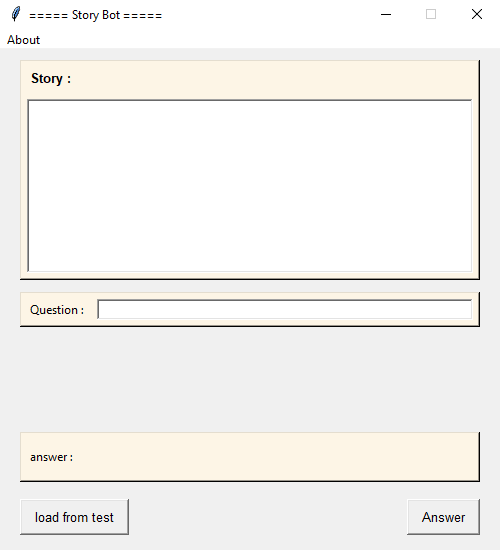
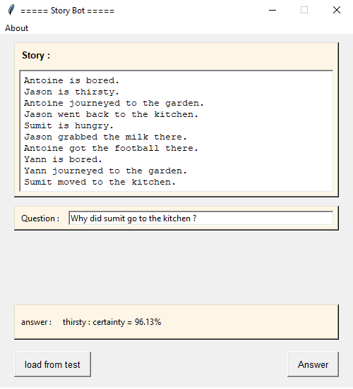
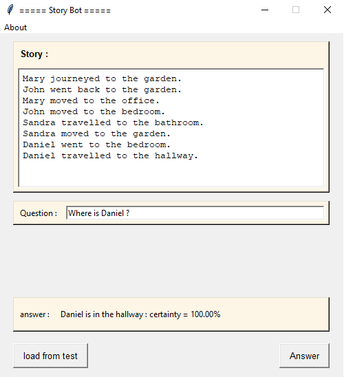
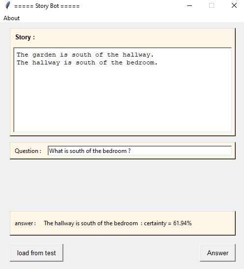
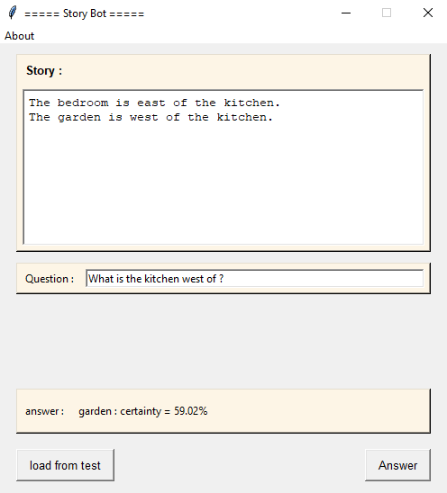

# Story Bot

## 🌍 Multilingual README Versions

- 🇫🇷 [Français](./README.fr.md)
- 🇬🇧 [English (you are here)](#)
- 🇪🇸 [Español](./README.es.md)

---

### 📘 Project Overview
This project, developed by a team of three as part of our Master's degree, aims to create a chatbot capable of answering questions in English about a story. For this, we use the bAbI dataset from Facebook AI Research, designed to evaluate the reasoning capabilities of machine learning models.

The bot reads a story, then awaits related questions, and attempts to answer them coherently. It relies on an embedding model trained directly on the dataset.

---

## 📁 Project Structure

The project is organized into several directories, each with a specific role:

- **Code**: Contains all Python scripts, including model creation, training, the graphical interface, and utility functions necessary for the chatbot's operation.

- **Data**: Gathers the dataset files used for training and testing, particularly the stories, questions, and answers from the bAbI dataset.

- **Network**: Stores the trained model, including both the network architecture and associated weights.

---

## 📊 Datasets

The **bAbI** dataset, developed by Facebook AI Research (FAIR), is a synthetic collection designed to test the reasoning capabilities of natural language processing models.

It consists of short stories followed by questions in English, each with a single correct answer. Each example is structured into three parts: a context (in the form of numbered sentences), a question, and the expected answer.

The goal is to enable a model to learn to read a story, reason across multiple sentences, and correctly answer a question by relying solely on relevant information. This dataset allows for the evaluation of various skills such as spatial or temporal understanding, logical reasoning, and short-term memory management.

---

## ⚙️ How a "Memory Network" Works

A Memory Network is a model designed to solve question-answering tasks on text by simulating a reasoning process with memory.

Here's a simple, step-by-step explanation of its operation:

### 🧾 Step 1 - Story Encoding
The story is converted into vectors via an **embedding** type encoding. Each word (or sentence) becomes a numerical vector. The model creates two parallel representations of this memory:
- one to compare the memory with the question
- the other to extract a contextual answer

### ❓ Step 2 - Question Encoding
The question is encoded separately to be compatible with the story's representations.

### 🎯 Step 3 - Attention Calculation
The model compares the question to each encoded story element to determine the most relevant parts. This is done via an **attention mechanism**, which assigns weights to each sentence in the story.

### 📚 Step 4 - Relevant Information Retrieval
The attention weights are used to combine the important parts of the memory to form a contextual answer. This answer is then merged with the question's encoding.

### 🔁 Step 5 - Sequential Processing with LSTM
The contextual answer + question combination is passed into an **LSTM**. This sequential network allows for reasoning about chronology and dependencies between memory elements.

### 🗣️ Step 6 - Answer Prediction
The LSTM's output is projected into the space of known words (vocabulary), then a **softmax** is used to choose the most probable answer.

### 📌 Result
The model learns to read, understand, and reason about short texts to provide relevant answers to questions posed in English.

---

## 🧱 Model Architecture

Here is the diagram of our model's architecture, illustrating the data flow through its different layers:


---

## 💻 Technologies Used

* **Language:** Python 3.10+
* **Libraries:** Keras
* **GUI:** Tkinter

---

## 🚀 Run the Project

To run this project and use the image classification models, follow these steps:

1.  Clone the repository:
    ```bash
    git clone [https://github.com/Fab16BSB/story_bot.git](https://github.com/Fab16BSB/story_bot.git)
    ```

2.  Install dependencies:
    ```bash
    cd story_bot
    pip install -r requirements.txt
    ```

3.  Execute the code:
    ```bash
    cd Code
    python Main.py
    ```

---

## 🖥️ Graphical Interface with Tkinter

The user interface is built with **Tkinter**, a standard Python module for developing graphical interfaces. It includes:

* An area to display the story.
* An area to display the current question.
* A field to enter a manual answer or view the generated one.
* Buttons to interact with the bot or change the scenario.



---

## 🧪 Results

These examples illustrate the model's ability to understand a short narrative, reason about its content, and provide coherent answers within the tasks proposed by the bAbI dataset.









---

## ⚠️ Limitations

* The model is restricted to the vocabulary present in the dataset; it does not recognize words not found there.
* The chatbot only functions in English; no other languages are supported.
* The system does not handle ambiguities or complex interpretations outside the scenarios provided in the dataset.
* Generated responses are limited to a single word, which restricts the richness of possible interactions.

---

## 🧑‍💻 Authors

* Zeineb Ghrib
* Nadia Essfini

---

## 📚 Sources

Our project primarily relies on the following resources:

📄 Reference Article: *End-To-End Memory Networks* — [View on arXiv](https://arxiv.org/pdf/1503.08895.pdf)

📦 Dataset Used: *bAbI dataset* — [Available on Kaggle](https://www.kaggle.com/datasets/roblexnana/the-babi-tasks-for-nlp-qa-system)
